.. include:: links.rst

###############################
ASL processing pipeline details
###############################

*ASLPrep* :footcite:p:`aslprep_nature_methods,aslprep_zenodo`
adapts its pipeline depending on what data and metadata are available and are used as inputs.
It requires the input data to be BIDS-valid and include necessary ASL parameters.

.. workflow::
    :graph2use: orig
    :simple_form: yes

    from aslprep.workflows.base import init_single_subject_wf

    wf = init_single_subject_wf("01")

************************
Structural Preprocessing
************************

The anatomical sub-workflow is from `sMRIPrep <https://github.com/nipreps/smriprep>`_.
It first constructs an average image by conforming all found T1w images
to a common voxel size, and, in the case of multiple images,
averages them into a single reference template.

.. workflow::
    :graph2use: orig
    :simple_form: yes

    from aslprep.niworkflows.utils.spaces import Reference, SpatialReferences
    from smriprep.workflows.anatomical import init_anat_preproc_wf

    wf = init_anat_preproc_wf(
        bids_root=".",
        freesurfer=False,
        hires=True,
        longitudinal=False,
        omp_nthreads=1,
        output_dir=".",
        skull_strip_mode="force",
        skull_strip_template=Reference("MNI152NLin2009cAsym"),
        spaces=SpatialReferences([
            ("MNI152Lin", {}),
            ("T1w", {}),
            ("fsnative", {})
        ]),
        skull_strip_fixed_seed=False,
        t1w=["sub-01/anat/sub-01_T1w.nii.gz"],
    )

See also *sMRIPrep*'s
:py:func:`~smriprep.workflows.anatomical.init_anat_preproc_wf`.

Brain extraction, brain tissue segmentation and spatial normalization
=====================================================================

Next, the T1w reference is skull-stripped using a Nipype implementation of
the ``antsBrainExtraction.sh`` tool (ANTs), which is an atlas-based
brain extraction workflow:

.. workflow::
    :graph2use: orig
    :simple_form: yes

    from aslprep.niworkflows.anat.ants import init_brain_extraction_wf

    wf = init_brain_extraction_wf()

An example of brain extraction is shown below:

.. figure:: _static/brainextraction_t1.svg

    Brain extraction

Once the brain mask is computed, FSL ``fast`` is used for brain tissue segmentation.

.. figure:: _static/segmentation.svg

    Brain tissue segmentation

Finally, spatial normalization to standard spaces is performed using ANTs' ``antsRegistration``
in a multiscale, mutual-information based, nonlinear registration scheme.
See :doc:`spaces` for more information on how standard and nonstandard spaces can
be set to resample the preprocessed data onto the final output spaces.

.. figure:: _static/T1MNINormalization.svg

    Animation showing spatial normalization of T1w onto the ``MNI152NLin2009cAsym`` template.

*****************
ASL preprocessing
*****************

:py:func:`~aslprep.workflows.asl.base.init_asl_preproc_wf`

.. workflow::
    :graph2use: orig
    :simple_form: yes

    from aslprep.tests.tests import mock_config
    from aslprep import config
    from aslprep.workflows.asl.base import init_asl_preproc_wf

    with mock_config():
        asl_file = str(config.execution.bids_dir / "sub-01" / "perf"/ "sub-01_asl.nii.gz")
        wf = init_asl_preproc_wf(asl_file)

Preprocessing of :abbr:`ASL (Arterial Spin Labelling)` files is
split into multiple sub-workflows described below.

.. topic:: Processing GE data

    ASLPrep can process data from any of the big three manufacturers (Siemens, Philips, GE),
    but GE ASL protocols are unique in that they typically only produce a single deltaM or CBF
    volume (optionally along with an M0 volume).

    For these short sequences, ASLPrep performs many of the same steps as for a longer sequence,
    but certain steps are dropped, including motion correction.
    Additionally, SCORE/SCRUB cannot be used with these short sequences,
    as the denoising method requires a long time series from which to identify outliers.

.. _asl_ref:

ASL reference image estimation
==============================

:py:func:`~aslrep.niworkflows.func.util.init_asl_reference_wf`

.. workflow::
    :graph2use: orig
    :simple_form: yes

    from aslprep.niworkflows.func.util import init_asl_reference_wf

    wf = init_asl_reference_wf(omp_nthreads=1)

This workflow estimates a reference image for an
:abbr:`ASL (Arterial Spin Labelling)` series.
The reference image is then used to calculate a brain mask for the
:abbr:`ASL (Arterial Spin Labelling)` signal using *NiWorkflow's*
:py:func:`~aslprep.niworkflows.func.util.init_enhance_and_skullstrip_asl_wf`.
Subsequently, the reference image is fed to the :ref:`head-motion estimation
workflow <asl_hmc>` and the :ref:`registration workflow <asl_reg>` to map the
ASL series onto the T1w image of the same subject.

    Calculation of a brain mask from the ASL series.

.. _asl_hmc:

Head-motion estimation
======================

:py:func:`~aslprep.workflows.asl.hmc.init_asl_hmc_wf`

.. workflow::
    :graph2use: orig
    :simple_form: yes

    from aslprep.workflows.asl.hmc import init_asl_hmc_wf

    wf = init_asl_hmc_wf(
        mem_gb=1,
        omp_nthreads=1,
    )

Using the previously :ref:`estimated reference scan <aslref>`,
FSL ``mcflirt`` or AFNI ``3dvolreg`` is used to estimate head-motion.
As a result, one rigid-body transform with respect to
the reference image is written for each :abbr:`ASL (Arterial Spin Labelling)`
time-step.
Additionally, a list of 6-parameters (three rotations and
three translations) per time-step is written and fed to the
:ref:`confounds workflow <asl_confounds>`,
for a more accurate estimation of head-motion.

.. _asl_confounds:

Confounds estimation
====================

:py:func:`~aslprep.workflows.asl.confounds.init_asl_confounds_wf`

.. workflow::
    :graph2use: orig
    :simple_form: yes

    from aslprep.workflows.asl.confounds import init_asl_confounds_wf

    wf = init_asl_confounds_wf(name="confound_wf", mem_gb=1)

Calculated confounds include framewise displacement, 6 motion parameters, and DVARS.

Susceptibility Distortion Correction (SDC)
==========================================

One of the major problems that affects :abbr:`EPI (echo planar imaging)` data
is the spatial distortion caused by the inhomogeneity of the field inside
the scanner.
Please refer to :doc:`sdc` for details on the available workflows.

.. figure:: _static/unwarping.svg

    Applying susceptibility-derived distortion correction, based on fieldmap estimation

See also *SDCFlows*' :py:func:`~sdcflows.workflows.base.init_sdc_estimate_wf`

.. _asl_preproc:

Preprocessed ASL in native space
================================

:py:func:`~aslprep.workflows.asl.resampling.init_asl_preproc_trans_wf`

.. workflow::
    :graph2use: orig
    :simple_form: yes

    from aslprep.workflows.asl.resampling import init_asl_preproc_trans_wf

    wf = init_asl_preproc_trans_wf(
        mem_gb=3,
        omp_nthreads=1,
    )

A new *preproc* :abbr:`ASL (Arterial Spin Labelling)` series is generated
from the original data in the original space.
All volumes in the :abbr:`ASL (Arterial Spin Labelling)` series are
resampled in their native space by concatenating the mappings found in previous correction workflows
(:abbr:`HMC (head-motion correction)` and :abbr:`SDC (susceptibility-derived distortion correction)`, if executed)
for a one-shot interpolation process.
Interpolation uses a Lanczos kernel.

    The preprocessed ASL with label and control.
    The signal plots above the carpet plot are framewise diplacement (FD) and DVRAS.

.. _cbf_preproc:

*******************************
CBF Computation in native space
*******************************

:py:func:`~aslprep.workflows.asl.cbf.init_compute_cbf_wf`

.. workflow::
    :graph2use: orig
    :simple_form: yes

    import json
    from pathlib import Path
    from pkg_resources import resource_filename as pkgrf

    from aslprep.workflows.asl.cbf import init_compute_cbf_wf

    bids_dir = Path(pkgrf("aslprep", "tests/data/ds000240")).absolute()
    metadata_file = bids_dir / "sub-01" / "perf"/ "sub-01_asl.json"
    with open(metadata_file) as f:
        metadata = json.load(f)

    wf = init_compute_cbf_wf(
        bids_dir=str(bids_dir),
        scorescrub=False,
        basil=False,
        metadata=metadata,
        M0Scale=1,
        smooth_kernel=5,
        dummy_vols=0,
    )

ASL data consist of multiple pairs of labeled and control images.
*ASLPrep* first checks for proton density-weighted volume(s)
(M0, ``sub-task_xxxx-acq-YYY_m0scan.nii.gz``).
In the absence of M0 images or an M0 estimate provided in the metadata,
the average of control images is used as the reference image.

After :ref:`preprocessing <asl_preproc>`, the pairs of labeled and control images are subtracted:

.. math::
    \Delta{M} = M_{C} - M_{L}

Single-PLD ASL
==============

The CBF computation of single-PLD (post labeling delay) ASL data is done using a relatively simple model.

Pseudo-Continuous ASL
---------------------

For (P)CASL ([pseudo-]continuous ASL),
CBF is calculated using a general kinetic model :footcite:p:`buxton1998general`:

.. math::
   CBF = \frac{ 6000 * \lambda * \Delta{M} * e ^ \frac{ w }{ T1_{blood} } } {2 * \alpha * M_{0} * T1_{blood} * (1 - e^{\frac{ - \tau }{ T1_{blood} } }) }

:math:`\tau`, :math:`\lambda`, :math:`\alpha`, and :math:`w` are labeling duration,
brain-blood partition coefficient, labeling efficiency, and post-labeling delay (PLD), respectively.

In the absence of any of these parameters, standard values are used based on the scan type and
scanning parameters.

The element which differentiates single-PLD PCASL's CBF calculation from the PASL equivalents is
:math:`T1_{blood} * (1 - e^{\frac{ - \tau }{ T1_{blood} } })`.

Pulsed ASL
----------

QUIPSS Modification
^^^^^^^^^^^^^^^^^^^

For pulsed ASL (PASL) data with the QUIPSS BolusCutOffTechnique,
the formula from :footcite:t:`wong1998quantitative` is used.

.. math::
   CBF = \frac{ 6000 * \lambda * \Delta{M} * e ^ \frac{ w }{ T1_{blood} } } {2 * \alpha * M_{0} * \Delta{TI} }

where :math:`\Delta{TI}` is the post-labeling delay (PLD) minus the bolus cutoff delay time.

Note that the formula for QUIPSS is the same as PCASL,
except :math:`\Delta{TI}` replaces :math:`T1_{blood} * (1 - e^{\frac{ - \tau }{ T1_{blood} } })`.

QUIPSS II Modification
^^^^^^^^^^^^^^^^^^^^^^

For PASL data with the QUIPSS II BolusCutOffTechnique,
the formula from :footcite:t:`alsop_recommended_2015` is used.

.. math::
   CBF = \frac{ 6000 * \lambda * \Delta{M} * e ^ \frac{ w }{ T1_{blood} } } {2 * \alpha * M_{0} * TI_{1} }

where :math:`TI_{1}` is the bolus cutoff delay time.

Note that the formula for QUIPSS II is the same as PCASL,
except :math:`TI_{1}` replaces :math:`T1_{blood} * (1 - e^{\frac{ - \tau }{ T1_{blood} } })`.

Q2TIPS Modification
^^^^^^^^^^^^^^^^^^^

.. warning::
    As of 0.3.0, ASLPrep does not support single-PLD PASL with the Q2TIPS BolusCutOffTechnique.
    We plan to support Q2TIPS data in the near future.

Multi-PLD ASL
=============

Pseudo-Continuous ASL
---------------------

For multi-PLD PCASL data, the following steps are taken:

1.  :math:`\Delta{M}` values are first averaged over time for each unique post-labeling delay value.
    We shall call these :math:`\Delta{M}` in the following equations for the sake of readability.

2.  Arterial transit time is estimated on a voxel-wise basis according to :footcite:t:`dai2012reduced`.

    1.  Define a set of possible transit times to evaluate.
        The range is defined as the minimum PLD to the maximum PLD, at increments of 0.001.

    2.  Calculate the expected weighted delay (:math:`WD_{E}`) for each possible transit time
        (:math:`\delta`), across PLDs (:math:`w`).

        .. math::

            WD_{E}(\delta_{t}, w_{i}) = e ^ \frac{ -t } { T_{1,blood} } \cdot
            ( e ^ \frac{ -max( 0, w_{i} - \delta_{t} ) } { T_{1,tissue} } -
            e ^ \frac{ -max( 0, w_{i} + \tau - \delta_{t} ) } { T_{1,tissue} } )

            WD_{E}(\delta_{t}) = \frac{ \sum_{i=1}^{|PLDs|} w_{i} \cdot
            WD_{E}(\delta_{t},w_{i}) } { \sum_{i=1}^{|PLDs|} WD_{E}(\delta_{t},w_{i}) }

    3.  Calculate the observed weighted delay (:math:`WD_{O}`) for the actual data, at each voxel :math:`v`.

        .. math::

            WD_{O}(v) = \frac{ \sum_{i=1}^{|PLDs|} w_i \cdot \Delta{M}( w_{i},v ) }
            { \sum_{i=1}^{|PLDs|} \Delta{M}(v) }

    4.  Truncate the observed weighted delays to valid delay values,
        determined based on the expected weighted delays.

        .. math::

            WD_{O}(v) = max[min(WD_{O}(v), max[WD_{E}]), min(WD_{E})]

    5.  Interpolate the expected weighted delay values to infer the appropriate transit time for each voxel,
        based on its observed weighted delay.

3.  CBF is then calculated for each unique PLD value using the 2-compartment model described in
    :footcite:t:`fan2017long`.

    .. math::

        CBF_{i} = 6000 \cdot \lambda \cdot \frac{ \Delta{M}_{i} }{ M_{0} } \cdot
        \frac{ e ^ { \frac{\delta}{T_{1,blood}} } } { 2 \cdot \alpha \cdot T_{1,blood} \cdot \left[ e ^ \frac{-max(w_{i} - \delta, 0)}{T_{1,tissue}} - e ^ \frac{-max(\tau + w_{i} - \delta, 0)}{T_{1,tissue}} \right] }

    Note that Equation 2 in :footcite:t:`fan2017long` uses different notation.
    :math:`T_{1,blood}` is referred to as :math:`T_{1a}`,
    :math:`T_{1,tissue}` is referred to as :math:`T_{1t}`,
    :math:`\Delta{M}` is referred to as :math:`M`,
    :math:`w` is referred to as :math:`PLD`,
    :math:`\delta` is referred to as :math:`ATT`,
    :math:`\tau` is referred to as :math:`LD`,
    and :math:`\alpha` is referred to as :math:`\epsilon`.

4.  CBF is then averaged over PLDs according to :footcite:t:`juttukonda2021characterizing`,
    in which an unweighted average is calculated for each voxel across all PLDs in which
    :math:`PLD + \tau \gt ATT`.

Pulsed ASL
----------

.. warning::
    As of 0.3.0, ASLPrep has disabled multi-PLD support.
    We plan to properly support multi-PLD data in the near future.

Additional Denoising Options
============================

For cases where data may be especially noisy (e.g., due to motion or a low-SNR protocol),
ASLPrep includes options to additionally denoise CBF estimates.

The two current options are SCORE/SCRUB and BASIL.

SCORE and SCRUB
---------------

ASLPrep includes the ability to denoise CBF with SCORE and SCRUB.

Structural Correlation based Outlier Rejection (SCORE) :footcite:p:`dolui2017structural`
detects and discards extreme outliers in the CBF volume(s) from the CBF time series.
SCORE first discards CBF volumes whose CBF within grey matter (GM)
means are 2.5 standard deviations away from the median of the CBF within GM.
Next, it iteratively removes volumes that are most structurally correlated
to the intermediate mean CBF map unless the variance within each tissue type starts increasing
(which implies an effect of white noise removal as opposed to outlier rejection).

The mean CBF after denoising by SCORE is plotted below

   Computed CBF maps denoised by SCORE

After discarding extreme outlier CBF volume(s) (if present) by SCORE,
SCRUB (Structural Correlation with RobUst Bayesian) uses robust Bayesian estimation
of CBF using iterative reweighted least square method :footcite:p:`dolui2016scrub` to denoise CBF.
The SCRUB algorithm is described below:

.. math::
   CBF_{SCRUB} =  \arg\max_{\theta} \sum_{t=1}^N \rho(CBF_{t} -\theta)  + \lambda(\theta -\mu)^2

   \mu =\sum_{i \in Tissue type} p \cdot \mu_{i}

:math:`CBF_{t}`, :math:`\mu`, :math:`\theta`, and :math:`p` equal CBF time series
(after any extreme outliers are discarded by SCORE),
mean CBF, ratio of temporal variance at each voxel to overall variance of all voxels,
and probability tissue maps, respectively.
Other variables include :math:`\lambda` and :math:`\rho` that represent the weighting parameter
and Tukey's bisquare function, respectively.

An example of CBF denoised by SCRUB is shown below.

.. figure:: _static/sub-20589_ses-11245_task-rest_desc-scrubplot_asl.svg

   Computed CBF maps denoised by SCRUB

BASIL
-----

*ASLPrep* also includes the option to compute CBF using the BASIL.

Bayesian Inference for Arterial Spin Labeling `(BASIL) <https://fsl.fmrib.ox.ac.uk/fsl/fslwiki/BASIL>`_
is an FSL tool for CBF estimation.

BASIL implements a simple kinetic model as described above,
but uses Bayesian Inference principles :footcite:p:`chappell2008variational`.
BASIL is mostly suitable for multi-PLD.
It includes bolus arrival time estimation with spatial regularization :footcite:p:`groves2009combined`
and the correction of partial volume effects :footcite:p:`chappell2011partial`.

A sample of BASIL CBF with spatial regularization is shown below:

   Computed CBF maps by BASIL

The CBF map shown below is the result of partial volume corrected CBF computed by BASIL.

   Partial volume corrected CBF maps by BASIL

************************
Quality control measures
************************

:py:func:`~aslprep.workflows.asl.qc.init_compute_cbf_qc_wf`

.. workflow::
    :graph2use: orig
    :simple_form: yes

    from pathlib import Path
    from pkg_resources import resource_filename as pkgrf

    from aslprep.workflows.asl.qc import init_compute_cbf_qc_wf

    bids_dir = Path(pkgrf("aslprep", "tests/data/ds000240")).absolute()
    asl_file = bids_dir / "sub-01" / "perf"/ "sub-01_asl.nii.gz"
    metadata = bids_dir / "sub-01" / "perf"/ "sub-01_asl.json"

    wf = init_compute_cbf_qc_wf(is_ge=False)

Quality control (QC) measures such as FD (framewise displacement), coregistration, normalization index,
and quality evaluation index (QEI) are included for all CBF maps.
The QEI :footcite:p:`dolui2017automated` evaluates the quality of the computed CBF maps considering
three factors:
structural similarity, spatial variability, and percentage of voxels in GM with negative CBF.

.. _asl_reg:

*******************************
ASL and CBF to T1w registration
*******************************

:py:func:`~aslprep.workflows.asl.registration.init_asl_reg_wf`

.. workflow::
    :graph2use: orig
    :simple_form: yes

    from aslprep.workflows.asl.registration import init_asl_reg_wf

    wf = init_asl_reg_wf(
        use_bbr=True,
        asl2t1w_dof=6,
        asl2t1w_init="register",
    )

*ASLPrep* uses the ``FSL BBR`` routine to calculate the alignment between each run's
:abbr:`ASL (arterial spin labelling)` reference image and the reconstructed subject using the
gray/white matter boundary.

    Animation showing :abbr:`ASL (arterial spin labelling)` to T1w registration.

FSL ``flirt`` is run with the :abbr:`BBR (boundary-based registration)` cost function, using the
``fast`` segmentation to establish the gray/white matter boundary.
After :abbr:`BBR (boundary-based registration)` is run,
the resulting affine transform will be compared to the initial transform found by ``flirt``.
Excessive deviation will result in rejection of the BBR refinement and acceptance
of the original affine registration.
The computed :ref:`CBF <cbf_preproc>` is registered to T1w using the transformation from ASL-T1w
registration.

Resampling ASL and CBF runs onto standard spaces
================================================

:py:func:`~aslprep.workflows.asl.resampling.init_asl_std_trans_wf`

.. workflow::
    :graph2use: orig
    :simple_form: yes

    from aslprep.niworkflows.utils.spaces import SpatialReferences
    from aslprep.workflows.asl.resampling import init_asl_std_trans_wf

    wf = init_asl_std_trans_wf(
        mem_gb=3,
        omp_nthreads=1,
        spaces=SpatialReferences(
            spaces=[("MNI152Lin", {})],
            checkpoint=True,
        ),
    )

This sub-workflow concatenates the transforms calculated upstream
(see `Head-motion estimation`_, `Susceptibility Distortion Correction (SDC)`_)
if fieldmaps are available, and an anatomical-to-standard transform from
`Structural Preprocessing`_ to map the ASL and CBF images to the standard spaces is given by the
``--output-spaces`` argument (see :doc:`spaces`).
It also maps the T1w-based mask to each of those standard spaces.

Transforms are concatenated and applied all at once, with one interpolation (Lanczos) step,
so as little information is lost as possible.

References
==========

.. footbibliography::
