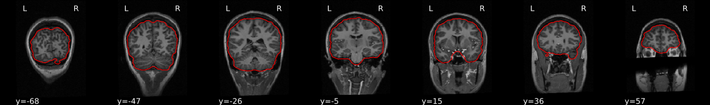

.. include:: links.rst

===========================
Processing pipeline details
===========================
*ASLPrep* adapts its pipeline depending on what data and metadata are
available and are used as the input.
For example, slice timing correction will be
performed only if the ``SliceTiming`` metadata field is found for the input
dataset.

A (very) high-level view of the simplest pipeline (for a single-band dataset with only
one task, single-run, with no slice-timing information nor fieldmap acquisitions)
is presented below:

.. workflow::
    :graph2use: orig
    :simple_form: yes

    from collections import namedtuple
    from aslprep.niworkflows.utils.spaces import Reference, SpatialReferences
    from aslprep.workflows.base import init_single_subject_wf
    BIDSLayout = namedtuple('BIDSLayout', ('root'))
    wf = init_single_subject_wf('01')

Preprocessing of structural MRI
-------------------------------
The anatomical sub-workflow first constructs an average image by
conforming all found T1w images to RAS orientation and
a common voxel size, and, in the case of multiple images, averages them into a
single reference template (see `Longitudinal processing`_).

.. workflow::
    :graph2use: orig
    :simple_form: yes

    from aslprep.niworkflows.utils.spaces import Reference, SpatialReferences
    from aslprep.smriprep.workflows.anatomical import init_anat_preproc_wf
    wf = init_anat_preproc_wf(
        bids_root='.',
        freesurfer=True,
        hires=True,
        longitudinal=False,
        omp_nthreads=1,
        output_dir='.',
        skull_strip_mode='force',
        skull_strip_template=Reference('MNI152NLin2009cAsym'),
        spaces=SpatialReferences([
            ('MNI152Lin', {}),
            ('fsaverage', {'density': '10k'}),
            ('T1w', {}),
            ('fsnative', {})
        ]),
        skull_strip_fixed_seed=False,
        t1w=['sub-01/anat/sub-01_T1w.nii.gz'],
    )

See also *sMRIPrep*'s
:py:func:`~aslprep.smriprep.workflows.anatomical.init_anat_preproc_wf`.

.. _t1preproc_steps:

Brain extraction, brain tissue segmentation and spatial normalization
~~~~~~~~~~~~~~~~~~~~~~~~~~~~~~~~~~~~~~~~~~~~~~~~~~~~~~~~~~~~~~~~~~~~~
Next, the T1w reference is skull-stripped using a Nipype implementation of
the ``antsBrainExtraction.sh`` tool (ANTs), which is an atlas-based
brain extraction workflow:

.. workflow::
    :graph2use: orig
    :simple_form: yes

    from aslprep.niworkflows.anat.ants import init_brain_extraction_wf
    wf = init_brain_extraction_wf()

An example of brain extraction is shown below:

    Brain extraction

Once the brain mask is computed, FSL ``fast`` is utilized for brain tissue segmentation.

.. figure:: _static/segmentation.svg

    Brain tissue segmentation

Finally, spatial normalization to standard spaces is performed using ANTs' ``antsRegistration``
in a multiscale, mutual-information based, nonlinear registration scheme.
See :ref:`output-spaces` for information about how standard and nonstandard spaces can
be set to resample the preprocessed data onto the final output spaces.

.. figure:: _static/T1MNINormalization.svg

    Animation showing spatial normalization of T1w onto the ``MNI152NLin2009cAsym`` template

Cost function masking during spatial normalization
~~~~~~~~~~~~~~~~~~~~~~~~~~~~~~~~~~~~~~~~~~~~~~~~~~
When processing images from patients with focal brain lesions (e.g., stroke, tumor
resection), it is possible to provide a lesion mask to be used during spatial
normalization to standard space [Brett2001]_.
ANTs will use this mask to minimize warping of healthy tissue into damaged
areas (or vice-versa).
Lesion masks should be binary NIFTI images (damaged areas = 1, everywhere else = 0)
in the same space and resolution as the T1 image, and follow the naming convention specified in
`BIDS Extension Proposal 3: Common Derivatives <https://docs.google.com/document/d/1Wwc4A6Mow4ZPPszDIWfCUCRNstn7d_zzaWPcfcHmgI4/edit#heading=h.9146wuepclkt>`_
(e.g., ``sub-001_T1w_label-lesion_roi.nii.gz``).
This file should be placed in the ``sub-*/anat`` directory of the BIDS dataset
to be run through *ASLPrep*.
Because lesion masks are not currently part of the BIDS specification, it is also necessary to
include a ``.bidsignore`` file in the root of your dataset directory. This will prevent
`bids-validator <https://github.com/bids-standard/bids-validator#bidsignore>`_ from complaining
that your dataset is not valid BIDS, which prevents *ASLPrep* from running.
Your ``.bidsignore`` file should include the following line::

  *lesion_roi.nii.gz

Longitudinal processing
~~~~~~~~~~~~~~~~~~~~~~~
In the case of multiple T1w images (across sessions and/or runs), T1w images are
merged into a single template image using FreeSurfer's `mri_robust_template`_.
This template may be *unbiased*, or equidistant from all source images, or
aligned to the first image (determined lexicographically by session label).
For two images, the additional cost of estimating an unbiased template is
trivial and is the default behavior, but three or more images may cause a significant slow-down.
Therefore, if there are more than two images, *ASLPrep* constructs
templates aligned to the first image, unless the ``--longitudinal`` flag is passed, which forces the estimation of an unbiased template.

.. note::

    The preprocessed T1w image defines the ``T1w`` space.
    In the case of multiple T1w images, this space may not be precisely aligned
    with any of the original images.
    Reconstructed surfaces and functional datasets will be registered to the
    ``T1w`` space, and not to the input images.

.. _workflows_surface:

Surface preprocessing
~~~~~~~~~~~~~~~~~~~~~
*ASLPrep* uses FreeSurfer_ to reconstruct surfaces from T1w/T2w
structural images.
If enabled, several steps in the *ASLPrep* pipeline are added or replaced.
All surface preprocessing may be disabled with the ``--fs-no-reconall`` flag.

.. note::
    Surface processing will be skipped if the outputs already exist.

    In order to bypass reconstruction in *ASLPrep*, place existing reconstructed
    subjects in ``<output dir>/freesurfer`` prior to the run, or specify an external
    subjects directory with the ``--fs-subjects-dir`` flag.
    *ASLPrep* will perform any missing ``recon-all`` steps, but will not perform
    any steps whose outputs already exist.

If FreeSurfer reconstruction is performed, the reconstructed subject is placed in
``<output dir>/freesurfer/sub-<subject_label>/`` (see :ref:`fsderivs`).

Surface reconstruction is performed in three phases.
The first phase initializes the subject with T1w and T2w (if available)
structural images and performs basic reconstruction (``autorecon1``) with the
exception of skull-stripping.
Skull-stripping is skipped since the brain mask :ref:`calculated previously
<t1preproc_steps>` is pulled into the appropriate location for FreeSurfer.
For example, a subject with only one session with T1w and T2w images
would be processed by the following command::

    $ recon-all -sd <output dir>/freesurfer -subjid sub-<subject_label> \
        -i <bids-root>/sub-<subject_label>/anat/sub-<subject_label>_T1w.nii.gz \
        -T2 <bids-root>/sub-<subject_label>/anat/sub-<subject_label>_T2w.nii.gz \
        -autorecon1 \
        -noskullstrip

The second phase imports the brainmask calculated in the
`Preprocessing of structural MRI`_ sub-workflow.
The final phase resumes reconstruction, using the T2w image to assist
in finding the pial surface, if available.
See :py:func:`~smriprep.workflows.surfaces.init_autorecon_resume_wf` for
details.

Reconstructed white and pial surfaces are included in the report.

    Surface reconstruction (FreeSurfer)

If T1w voxel sizes are less than 1mm in all dimensions (rounding to nearest
.1mm), `submillimeter reconstruction`_ is used, unless disabled with
``--no-submm-recon``.

``lh.midthickness`` and ``rh.midthickness`` surfaces are created in the subject
``surf/`` directory, corresponding to the surface half-way between the gray/white
boundary and the pial surface.
The ``smoothwm``, ``midthickness``, ``pial`` and ``inflated`` surfaces are also
converted to GIFTI_ format and adjusted to be compatible with multiple software
packages, including FreeSurfer and the `Connectome Workbench`_.

.. note::
    GIFTI surface outputs are aligned to the FreeSurfer T1.mgz image, which
    may differ from the T1w space in some cases, to maintain compatibility
    with the FreeSurfer directory.
    Any measures sampled to the surface take into account any differences in
    these images.

.. workflow::
    :graph2use: orig
    :simple_form: yes

    from aslprep.smriprep.workflows.surfaces import init_surface_recon_wf
    wf = init_surface_recon_wf(omp_nthreads=1,
                               hires=True)

See also *sMRIPrep*'s
:py:func:`~aslprep.smriprep.workflows.surfaces.init_surface_recon_wf`

Refinement of the brain mask
~~~~~~~~~~~~~~~~~~~~~~~~~~~~
Typically, the original brain mask calculated with ``antsBrainExtraction.sh``
will contain some innaccuracies including small amounts of MR signal from
outside the brain.
Based on the tissue segmentation of FreeSurfer (located in ``mri/aseg.mgz``)
and only when the :ref:`Surface Processing <workflows_surface>` step has been
executed, *ASLPrep* replaces the brain mask with a refined one that derives
from the ``aseg.mgz`` file as described in
:py:func:`~aslprep.interfaces.freesurfer.grow_mask`.

ASLPrep preprocessing
----------------------
:py:func:`~aslprep.workflows.bold.base.init_func_preproc_wf`

.. workflow::
    :graph2use: orig
    :simple_form: yes

    from aslprep.workflows.tests import mock_config
    from aslprep import config
    from aslprep.workflows.bold.base import init_func_preproc_wf
    with mock_config():
        bold_file = config.execution.bids_dir / 'sub-01' / 'perf'/ 'sub-01_task-restEyesOpen_asl.nii.gz'
        wf = init_func_preproc_wf(str(bold_file))

Preprocessing of :abbr:`ASL (Arterial Spin Labelling)` files is
split into multiple sub-workflows described below.

.. _asl_ref:

ASL reference image estimation
~~~~~~~~~~~~~~~~~~~~~~~~~~~~~~~
:py:func:`~aslrep.niworkflows.func.util.init_bold_reference_wf`

.. workflow::
    :graph2use: orig
    :simple_form: yes

    from aslprep.niworkflows.func.util import init_bold_reference_wf
    wf = init_bold_reference_wf(omp_nthreads=1)

This workflow estimates a reference image for an
:abbr:`ASL (Arterial Spin Labelling)` series.
When T1-saturation effects ("dummy scans" or non-steady state volumes) are
detected, they are averaged and used as reference due to their
superior tissue contrast.
Otherwise, a median of motion corrected subset of volumes is used.

The reference image is then used to calculate a brain mask for the
:abbr:`ASL (Arterial Spin Labelling)` signal using *NiWorkflow's*
:py:func:`~aslprep.niworkflows.func.util.init_enhance_and_skullstrip_bold_wf`.
Further, the reference is fed to the :ref:`head-motion estimation
workflow <asl_hmc>` and the :ref:`registration workflow to map
ASL series into the T1w image of the same subject <asl_reg>`.

.. figure:: _static/brainextraction.svg

    Calculation of a brain mask from the ASL series.

.. _asl_hmc:

Head-motion estimation
~~~~~~~~~~~~~~~~~~~~~~
:py:func:`~aslprep.workflows.bold.hmc.init_bold_hmc_wf`

.. workflow::
    :graph2use: colored
    :simple_form: yes

    from aslprep.workflows.bold import init_bold_hmc_wf # Is this still what it's called?
    wf = init_bold_hmc_wf(
        mem_gb=1,
        omp_nthreads=1)

Using the previously :ref:`estimated reference scan <asl_ref>`,
FSL ``mcflirt`` is used to estimate head-motion.
As a result, one rigid-body transform with respect to
the reference image is written for each :abbr:`ASL (Arterial Spin Labelling)`
time-step.
Additionally, a list of 6-parameters (three rotations,
three translations) per time-step is written and fed to the
:ref:`confounds workflow <asl_confounds>`.
For a more accurate estimation of head-motion, we calculate its parameters
before any time-domain filtering (i.e., :ref:`slice-timing correction <asl_stc>`),
as recommended in [Power2017]_.

.. _asl_stc:

Slice time correction
~~~~~~~~~~~~~~~~~~~~~
:py:func:`~aslprep.workflows.bold.stc.init_bold_stc_wf`

.. workflow::
    :graph2use: colored
    :simple_form: yes

    from aslprep.workflows.bold import init_bold_stc_wf
    wf = init_bold_stc_wf(
        metadata={'RepetitionTime': 2.0,
                  'SliceTiming': [0.0, 0.1, 0.2, 0.3, 0.4, 0.5, 0.6, 0.7, 0.8, 0.9]},
        )

If the ``SliceTiming`` field is available within the input dataset metadata,
this workflow performs slice time correction prior to other signal resampling
processes.
Slice time correction is performed using AFNI ``3dTShift``.
All slices are realigned in time to the middle of each TR.

Slice time correction can be disabled with the ``--ignore slicetiming``
command line argument.
If an :abbr:`ASL (Arterial Spin Labelling)` series has fewer than
5 usable (steady-state) volumes, slice time correction will be disabled
for that run.

Susceptibility Distortion Correction (SDC)
~~~~~~~~~~~~~~~~~~~~~~~~~~~~~~~~~~~~~~~~~~
One of the major problems that affects :abbr:`EPI (echo planar imaging)` data
is the spatial distortion caused by the inhomogeneity of the field inside
the scanner.
Please refer to :ref:`sdc` for details on the
available workflows.

.. figure:: _static/unwarping.svg

    Applying susceptibility-derived distortion correction, based on
    fieldmap estimation

See also *SDCFlows*' :py:func:`~sdcflows.workflows.base.init_sdc_estimate_wf`

.. _asl_preproc:

Preprocessed ASL in native space
~~~~~~~~~~~~~~~~~~~~~~~~~~~~~~~~~~
:py:func:`~aslprep.workflows.bold.base.init_func_preproc_wf`

.. workflow::
    :graph2use: orig
    :simple_form: yes

    from aslprep.workflows.bold import init_bold_preproc_trans_wf
    wf = init_bold_preproc_trans_wf(mem_gb=3, omp_nthreads=1)

.. figure:: _static/sub-20589_ses-11245_task-rest_desc-carpetplot_asl.svg

    The preprocessed ASL with label and control.The signal plots above the carpetotplot 
    are framewise diplacement (FD) and DVRAS. 

A new *preproc* :abbr:`ASL (Arterial Spin Labelling)` series is generated
from the slice-timing corrected or the original data (if
:abbr:`STC (slice-timing correction)` was not applied) in the
original space.
All volumes in the :abbr:`ASL (Arterial Spin Labelling)` series are
resampled in their native space by concatenating the mappings found in previous
correction workflows (:abbr:`HMC (head-motion correction)` and
:abbr:`SDC (susceptibility-derived distortion correction)`, if excecuted)
for a one-shot interpolation process.
Interpolation uses a Lanczos kernel.

    

.. _cbf_preproc:

CBF Computation in native space
~~~~~~~~~~~~~~~~~~~~~~~~~~~~~~~
:py:func:`~aslprep.workflows.bold.cbf.init_cbf_compt_wf`

.. workflow::
    :graph2use: orig
    :simple_form: yes

    from pathlib import Path
    from pkg_resources import resource_filename as pkgrf
    bids_dir=Path(pkgrf('aslprep', 'data/tests/ds000240')).absolute()
    metadatafile = bids_dir / 'sub-01' / 'perf'/ 'sub-01_task-restEyesOpen_asl.json'
    import json
    with open(metadatafile) as f:
        metadata = json.load(f)
    from aslprep.workflows.bold.cbf import init_cbf_compt_wf
    wf = init_cbf_compt_wf(mem_gb=0.1,metadata=metadata, omp_nthreads=4,smooth_kernel=5,dummy_vols=0)

ALl the CBF derivates are computed from pre-processed :ref:`ASL <asl_preproc>`.
This inlude CBF computation by basic model and :abbr:`BASIL (Bayesian Inference for Arterial Spin Labeling )`.
The BASIL includes spatial regularization and partial volume correction.
The computed CBF are further denoised by :abbr:`SCORE (Structural Correlation based Outlier Rejection)`
and :abbr:`SCRUB (Structural Correlation withRobUst Bayesian)`

    The carpet plot of computed CBF. The step plot  above indicated the volume(s) marked by SCORE algorithm  
    to be contaminated by noise. 

   Computed CBF maps 

.. figure:: _static/sub-20589_ses-11245_task-rest_desc-scoreplot_asl.svg

   Computed CBF maps denoised by SCORE

   Computed CBF maps denoised by SCRUB

.. figure:: _static/sub-20589_ses-11245_task-rest_desc-basilplot_asl.svg

   Computed CBF maps by BASIL 

.. figure:: _static/sub-20589_ses-11245_task-rest_desc-pvcplot_asl.svg

   Paritial volume corrected  CBF maps by BASIL 

.. _cbf_qc:

Quality Controle measures
~~~~~~~~~~~~~~~~~~~~~~~~~~~~~~~
:py:func:`~aslprep.workflows.bold.cbf.init_cbfqc_compt_wf`

.. workflow::
    :graph2use: orig
    :simple_form: yes

    from pathlib import Path
    from pkg_resources import resource_filename as pkgrf
    bids_dir=Path(pkgrf('aslprep', 'data/tests/ds000240')).absolute()
    from aslprep.workflows.bold.cbf import init_cbfqc_compt_wf
    bold_file = bids_dir / 'sub-01' / 'perf'/ 'sub-01_task-restEyesOpen_asl.nii.gz'
    metadata = bids_dir / 'sub-01' / 'perf'/ 'sub-01_task-restEyesOpen_asl.json'
    wf = init_cbfqc_compt_wf(mem_gb=0.1,bold_file=str(bold_file),metadata=str(metadata),omp_nthreads=1)

The  quality control (QC) measures such as FD, coregistration and nornmalization index and 
quality evaluation index (QEI) all CBF maps.

.. _asl_reg:

ASL and CBF to T1w registration
~~~~~~~~~~~~~~~~~~~~~~~~~~~~~~~~
:py:func:`~aslprep.workflows.bold.registration.init_bold_reg_wf`

.. workflow::
    :graph2use: orig
    :simple_form: yes

    from aslprep.workflows.bold import init_bold_reg_wf
    wf = init_bold_reg_wf(
        freesurfer=True,
        mem_gb=1,
        omp_nthreads=1,
        use_bbr=True,
        bold2t1w_dof=9,
        bold2t1w_init='register')

The alignment between the reference :abbr:`ASL (arterial spin labelling)` image
of each run and the reconstructed subject using the gray/white matter boundary
(FreeSurfer's ``?h.white`` surfaces) is calculated by the ``bbregister`` routine.

.. figure:: _static/EPIT1Normalization.svg

    Animation showing :abbr:`ASL (arterial spin labelling)` to T1w registration (FreeSurfer ``bbregister``)

If FreeSurfer processing is disabled, FSL ``flirt`` is run with the
:abbr:`BBR (boundary-based registration)` cost function, using the
``fast`` segmentation to establish the gray/white matter boundary.
After :abbr:`BBR (boundary-based registration)` is run, the resulting affine transform will be compared to the initial transform found by FLIRT.
Excessive deviation will result in rejection of the BBR refinement and acceptance of the original affine registration.
The computed :ref:`CBF <cbf_preproc>`  is regsitered to T1w using the transformation from ASL-T1w registration.

Resampling ASL  and CBF runs onto standard spaces
~~~~~~~~~~~~~~~~~~~~~~~~~~~~~~~~~~~~~~~~~~~~~~~~~
:py:func:`~aslprep.workflows.bold.resampling.init_bold_std_trans_wf`

.. workflow::
    :graph2use: colored
    :simple_form: yes

    from aslprep.niworkflows.utils.spaces import SpatialReferences
    from aslprep.workflows.bold import init_bold_std_trans_wf
    wf = init_bold_std_trans_wf(
        freesurfer=True,
        mem_gb=3,
        omp_nthreads=1,
        spaces=SpatialReferences(
            spaces=[('MNI152Lin', {}), ('MNIPediatricAsym', {'cohort': '6'})],
            checkpoint=True),
    )

This sub-workflow concatenates the transforms calculated upstream (see
`Head-motion estimation`_, `Susceptibility Distortion Correction (SDC)`_ if
fieldmaps are available, and an anatomical-to-standard
transform from `Preprocessing of structural MRI`_ to map the
:abbr:`EPI (echo-planar imaging)`
image to the standard spaces given by the ``--output-spaces`` argument
(see :ref:`output-spaces`).
It also maps the T1w-based mask to each of those standard spaces.

Transforms are concatenated and applied all at once, with one interpolation (Lanczos)
step, so as little information is lost as possible.

The output space grid can be specified using modifiers to the ``--output-spaces``
argument.

.. _asl_confounds:

Confounds estimation
~~~~~~~~~~~~~~~~~~~~
:py:func:`~aslprep.workflows.bold.confounds.init_bold_confs_wf`

.. workflow::
    :graph2use: colored
    :simple_form: yes

    from aslprep.workflows.bold.confounds import init_bold_confs_wf
    wf = init_bold_confs_wf(
        name="discover_wf",
        mem_gb=1,
        metadata={"RepetitionTime": 2.0,
                  "SliceTiming": [0.0, 0.1, 0.2, 0.3, 0.4, 0.5, 0.6, 0.7, 0.8, 0.9]},
    )

The `discover_wf` sub-workflow calculates potential confounds per volume, if given motion-corrected ASL, a brain mask, ``mcflirt`` movement parameters, and segmentation. 

Calculated confounds include Frame-wise Displacement, 6 motion parameters, and DVARS.
